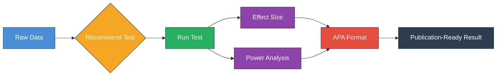

# Stats (<code>scitex-stats</code>)

<p align="center">
  <a href="https://scitex.ai">
    
  </a>
</p>

<p align="center"><b>Publication-ready statistical testing with 23 tests, effect sizes, power analysis, and APA formatting</b></p>

<p align="center">
  <a href="https://badge.fury.io/py/scitex-stats"></a>
  <a href="https://scitex-stats.readthedocs.io/"></a>
  <a href="https://www.gnu.org/licenses/agpl-3.0"></a>
</p>

<p align="center">
  <a href="https://scitex-stats.readthedocs.io/">Full Documentation</a> · <code>pip install scitex-stats</code>
</p>

---

## Problem

Statistical testing in Python is fragmented across `scipy`, `statsmodels`, and `pingouin` — each with different interfaces and output conventions. Getting publication-ready results requires substantial manual work: computing effect sizes, running power analysis, formatting to APA or journal standards. AI agents face a further barrier: they cannot call Python libraries directly and need structured, tool-based access.

## Solution

scitex-stats provides a unified interface that covers the full statistical workflow:

- **23 statistical tests** with automatic recommendation based on data characteristics
- **Built-in effect sizes** (Cohen's d, Cliff's delta, eta squared), **power analysis**, and **APA-formatted output**
- **Three interfaces** — Python API, CLI, and MCP server — so human researchers and AI agents use the same engine



*Figure 1. Statistical testing workflow. scitex-stats automates the full pipeline from raw data to publication-ready results: test recommendation based on data characteristics, test execution with effect size and power analysis, and APA-formatted output.*

## Installation

Requires Python >= 3.10.

```bash
pip install scitex-stats

# With MCP server for AI agents
pip install scitex-stats[mcp]

# Everything
pip install scitex-stats[all]
```

> **SciTeX users**: `pip install scitex` already includes Stats. Use `import scitex` then `scitex.stats`.

## Quickstart

```python
import scitex_stats as ss

# Get test recommendation
ctx = ss.StatContext(n_groups=2, paired=False)
recs = ss.recommend_tests(ctx)

# Run a test
result = ss.run_test("ttest_ind", data=group1, data2=group2)

# APA-formatted output
print(result["formatted"])
```

## Three Interfaces

<details>
<summary><strong>Python API</strong></summary>

<br>

```python
import scitex_stats as ss

# Automatic test recommendation
ctx = ss.StatContext(n_groups=2, paired=False)
recs = ss.recommend_tests(ctx)

# Run a test
result = ss.run_test("ttest_ind", data=group1, data2=group2)

# Effect sizes
from scitex_stats import effect_sizes
d = effect_sizes.cohens_d(group1, group2)

# Power analysis
from scitex_stats import power
n = power.sample_size_ttest(effect_size=0.5, alpha=0.05, power=0.8)

# Multiple comparison correction
from scitex_stats import correct
corrected = correct.correct_fdr(results)

# Post-hoc tests
from scitex_stats import posthoc
results = posthoc.tukey_hsd(groups)
```

> **[Full API reference](https://scitex-stats.readthedocs.io/)**

</details>

<details>
<summary><strong>CLI Commands</strong></summary>

<br>

```bash
scitex-stats --help-recursive                # Show all commands
scitex-stats list-python-apis                # List Python API tree
scitex-stats list-python-apis -v             # With docstrings
scitex-stats mcp list-tools                  # List MCP tools
scitex-stats mcp doctor                      # Check server health
scitex-stats mcp start                       # Start MCP server
```

> **[Full CLI reference](https://scitex-stats.readthedocs.io/)**

</details>

<details>
<summary><strong>MCP Server — for AI Agents</strong></summary>

<br>

AI agents can run statistical tests and format publication-ready results autonomously.

| Tool | Description |
|------|-------------|
| `recommend_tests` | Recommend appropriate tests based on data characteristics |
| `run_test` | Execute a statistical test on provided data |
| `format_results` | Format results in journal style (APA, Nature, etc.) |
| `power_analysis` | Calculate statistical power or required sample size |
| `correct_pvalues` | Apply multiple comparison correction |
| `describe` | Calculate descriptive statistics |
| `effect_size` | Calculate effect size between groups |
| `normality_test` | Test whether data follows normal distribution |
| `posthoc_test` | Run post-hoc pairwise comparisons |
| `p_to_stars` | Convert p-value to significance stars |

*Table 1. MCP tools available for AI agent integration via `scitex-stats mcp start`.*

```bash
scitex-stats mcp start
```

> **[Full MCP specification](https://scitex-stats.readthedocs.io/)**

</details>

## Available Tests

| Category | Tests |
|----------|-------|
| **Parametric** | t-test (ind, paired, 1-sample), ANOVA (1-way, RM, 2-way) |
| **Nonparametric** | Mann-Whitney U, Wilcoxon, Kruskal-Wallis, Friedman, Brunner-Munzel |
| **Correlation** | Pearson, Spearman, Kendall, Theil-Sen |
| **Categorical** | Chi-squared, Fisher exact, McNemar, Cochran's Q |
| **Normality** | Shapiro-Wilk, Kolmogorov-Smirnov (1-sample, 2-sample) |

*Table 2. All 23 statistical tests organized by category.*

## Part of SciTeX

Stats is part of [**SciTeX**](https://scitex.ai). When used inside the SciTeX framework, statistical testing integrates with the full pipeline:

```python
import scitex

@scitex.session
def main(CONFIG=scitex.INJECTED):
    data = scitex.io.load("measurements.csv")
    result = scitex.stats.run_test("ttest_ind", data=group1, data2=group2)
    scitex.io.save(result, "stats_result.csv")
    return 0
```

The SciTeX ecosystem follows the Four Freedoms for researchers:

> Four Freedoms for Research
>
> 0. The freedom to **run** your research anywhere — your machine, your terms.
> 1. The freedom to **study** how every step works — from raw data to final manuscript.
> 2. The freedom to **redistribute** your workflows, not just your papers.
> 3. The freedom to **modify** any module and share improvements with the community.
>
> AGPL-3.0 — because research infrastructure deserves the same freedoms as the software it runs on.

---

<p align="center">
  <a href="https://scitex.ai" target="_blank"></a>
</p>

<!-- EOF -->
