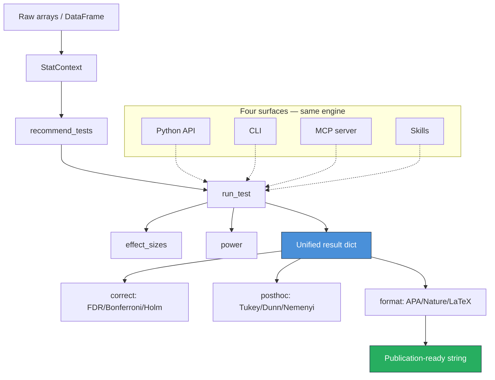
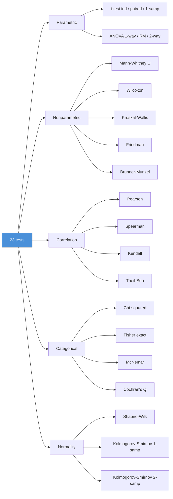
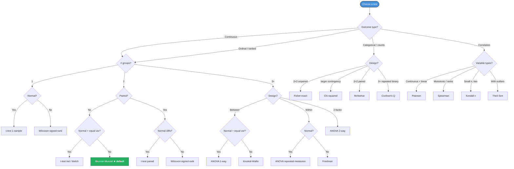

# SciTeX Stats (<code>scitex-stats</code>)

<p align="center">
  <a href="https://scitex.ai">
    
  </a>
</p>

<p align="center"><b>Publication-ready statistical testing with 23 tests, effect sizes, power analysis, and APA formatting</b></p>

<p align="center">
  <a href="https://scitex-stats.readthedocs.io/">Full Documentation</a> · <code>uv pip install "scitex-stats[all]"</code>
</p>

<!-- scitex-badges:start -->
<p align="center">
  <a href="https://pypi.org/project/scitex-stats/"></a>
  <a href="https://pypi.org/project/scitex-stats/"></a>
  <a href="https://scitex-stats.readthedocs.io/en/latest/"></a>
</p>
<p align="center">
  <a href="https://github.com/ywatanabe1989/scitex-stats/actions/workflows/test.yml"></a>
  <a href="https://github.com/ywatanabe1989/scitex-stats/actions/workflows/install-test.yml"></a>
  <a href="https://codecov.io/gh/ywatanabe1989/scitex-stats/branch/develop"></a>
</p>
<!-- scitex-badges:end -->

---

## Problem and Solution

| # | Problem | Solution |
|---|---------|----------|
| 1 | **Bare `scipy.stats` returns `(statistic, p)`** — effect size, CI, normality check, power each need manual follow-up calls. | **One call, one dict** — `ss.run_test("ttest_ind", g1, g2)` returns statistic, p, Cohen's d, power, and an APA string in a unified result dict. |
| 2 | **Test selection requires expertise** — parametric vs non-parametric, paired vs independent, one-way vs repeated-measures. | **Auto-recommend** — `ss.recommend_tests(StatContext(...))` ranks the appropriate tests from the design alone. |
| 3 | **APA formatting is manual** — every paper spells out `t(58) = 2.34, p = .021, d = 0.60` by hand. | **`result["formatted"]`** — APA / Nature / LaTeX strings live on the same result dict every test returns. |


## Quick Start

```python
import numpy as np
import scitex_stats as ss

rng = np.random.default_rng(42)
group1 = rng.normal(0.0, 1.0, 30)
group2 = rng.normal(0.5, 1.0, 30)

# Unified test API — same dict shape for every one of the 23 tests
result = ss.run_test("ttest_ind", data=group1, data2=group2)

assert result["stat_symbol"] == "t"
assert result["effect_size_metric"] == "Cohen's d"
assert result["significant"] is True
print(result["formatted"])
# → t = -3.2101, p = 0.0022, Cohen's d = -0.829, **
```

<details>
<summary><b>Unified result dictionary (every test returns this shape)</b></summary>

<br>

```json
{
  "test_method": "Student's t-test (independent)",
  "statistic": -3.210,
  "stat_symbol": "t",
  "alternative": "two-sided",
  "n_x": 30,
  "n_y": 30,
  "pvalue": 0.0022,
  "stars": "**",
  "alpha": 0.05,
  "significant": true,
  "effect_size": -0.829,
  "effect_size_metric": "Cohen's d",
  "effect_size_interpretation": "large",
  "power": 0.884,
  "H0": "μ(x) = μ(y)",
  "formatted": "t = -3.210, p = 0.0022, Cohen's d = -0.829, **"
}
```

</details>

## Installation

```bash
uv pip install "scitex-stats[all]"
```

<details>
<summary><b>Per-module extras</b></summary>

<br>

| Extra | Pulls in |
|---|---|
| `mcp` | fastmcp (MCP server for AI agents) |
| `plot` | matplotlib (for the optional plotting helpers) |
| `figrecipe` | figrecipe (publication figures + auto CSV export) |
| `all` | `mcp` + `plot` + `figrecipe` (recommended) |
| `dev` | pytest, pytest-cov, nbconvert, ipykernel, + every optional dep so the test suite runs |
| `docs` | Sphinx + RTD theme + myst-parser (docs build only) |

```bash
uv pip install "scitex-stats[mcp]"        # MCP server only
uv pip install -e ".[dev]"                # editable install for contributors
pip install scitex-stats[all]             # pip works too, just slower
```

</details>

## How it works

### 1. Describe the design, recommend the test

`StatContext` captures the experimental design — number of groups, sample
sizes, outcome type, paired vs between. `recommend_tests` ranks the
appropriate tests from that context alone, before any data is touched.

```python
ctx = ss.StatContext(
    n_groups=2, sample_sizes=[30, 30],
    outcome_type="continuous", design="between", paired=False,
)
ss.recommend_tests(ctx, top_k=3)
# → ['ttest_ind', 'welch_t', 'brunner_munzel']
```

### 2. Run the test, get the unified result

`run_test` is the single dispatcher for all 23 tests. The same result
dict shape (`statistic`, `pvalue`, `effect_size`, `power`, `formatted`,
…) makes the downstream code test-agnostic.



<p align="center"><sub><b>Figure 1.</b> Data flow and the four surfaces (Python, CLI, MCP, Skills) that share the same <code>run_test</code> engine. Every interface emits the unified result dict, which downstream formatters and corrections consume.</sub></p>

### 3. Effect sizes, power, corrections

Every numeric result is built from the same primitives. Use them
standalone when the dispatcher's defaults aren't quite right.

```python
from scitex_stats import effect_sizes, power, correct

effect_sizes.cohens_d(group1, group2)            # → -0.829
power.sample_size_ttest(effect_size=0.5,
                        alpha=0.05, power=0.8)   # → required n per group
correct.correct_fdr(results, alpha=0.05,
                    method="bh")                 # BH adjusted p-values
```

### 4. Linter for migration and hooks

`scitex-stats` ships 6 stats-specific lint rules (`STX-ST001..006`).
They are detected automatically by
[`scitex-dev`](https://github.com/ywatanabe1989/scitex-dev)'s linter,
already a hard dependency — no extra install.

```bash
scitex-dev linter check-files src/                # lint a tree
scitex-dev linter list-rules --category stats     # show live rule definitions
```

<details>
<summary><b>Rule reference (STX-ST001..006)</b></summary>

<br>

| Rule | Severity | Trigger |
|------|----------|---------|
| `STX-ST001` | warning | `scipy.stats.ttest_ind()` — use `ss.run_test("ttest_ind", ...)` for auto effect size + CI + power |
| `STX-ST002` | warning | `scipy.stats.mannwhitneyu()` — use `ss.run_test("mannwhitneyu", ...)` for auto effect size |
| `STX-ST003` | warning | `scipy.stats.pearsonr()` — use `ss.run_test("pearsonr", ...)` for auto CI + power |
| `STX-ST004` | warning | `scipy.stats.f_oneway()` — use `ss.run_test("anova_oneway", ...)` for post-hoc + effect sizes |
| `STX-ST005` | warning | `scipy.stats.wilcoxon()` — use `ss.run_test("wilcoxon", ...)` for auto effect size |
| `STX-ST006` | warning | `scipy.stats.kruskal()` — use `ss.run_test("kruskal", ...)` for post-hoc + effect sizes |

</details>

### 5. Etc.

<details>
<summary><b>Descriptive statistics, post-hoc, normality checks</b></summary>

<br>

```python
from scitex_stats import describe, posthoc

describe(data)                              # mean, sd, median, IQR, skew, kurtosis
posthoc.posthoc_tukey([g1, g2, g3])         # pairwise Tukey HSD
ss.run_test("shapiro", data=group1)         # normality check, same result dict shape
```

</details>

## Available Tests



<p align="center"><sub><b>Figure 2.</b> The 23 tests grouped by family. Every leaf is callable through the same <code>run_test(name, ...)</code> dispatcher and returns the unified result dict (Figure 1).</sub></p>



<p align="center"><sub><b>Figure 3.</b> Decision flowchart for choosing a statistical test. Start from outcome type, branch by number of groups and study design. Brunner-Munzel (★) is the recommended default for two-group continuous comparisons — robust to unequal variances and non-normality.</sub></p>

## Examples

Three runnable notebooks under [`examples/`](./examples/) — each one
executes end-to-end in CI and is the canonical reference for its
workflow.

| Notebook | Workflow |
|----------|----------|
| [`01_basic_ttest.ipynb`](./examples/01_basic_ttest.ipynb) | `run_test("ttest_ind", ...)` → unified result dict → APA string |
| [`02_test_recommendation.ipynb`](./examples/02_test_recommendation.ipynb) | `StatContext` → `recommend_tests` → top recommendation through `run_test` |
| [`03_multiple_comparison.ipynb`](./examples/03_multiple_comparison.ipynb) | Family of comparisons → `correct.correct_fdr` (Benjamini-Hochberg) |

```bash
# Re-execute every notebook in place (refreshes outputs)
bash examples/00_run_all.sh
```

## Four Interfaces

<details>
<summary><strong>Python API ⭐⭐⭐</strong></summary>

<br>

```python
import scitex_stats as ss
from scitex_stats import effect_sizes, power, correct, posthoc

ss.run_test("ttest_ind", data=g1, data2=g2)             # 23 tests, one dispatcher
ss.recommend_tests(ss.StatContext(n_groups=2, ...))     # design-driven test selection
effect_sizes.cohens_d(g1, g2)                           # standalone effect size
power.sample_size_ttest(effect_size=0.5,
                        alpha=0.05, power=0.8)          # power / sample size
correct.correct_fdr(results, alpha=0.05, method="bh")   # multiple-comparison correction
posthoc.posthoc_tukey([g1, g2, g3])                     # post-hoc pairwise tests
```

> **[Full API reference](https://scitex-stats.readthedocs.io/en/latest/api/scitex_stats.html)**

</details>

<details>
<summary><strong>CLI Commands ⭐</strong></summary>

<br>

```bash
scitex-stats --help-recursive                # Show all commands
scitex-stats list-python-apis                # List Python API tree
scitex-stats list-python-apis -v             # With docstrings
scitex-stats mcp list-tools                  # List MCP tools
scitex-stats mcp doctor                      # Check server health
scitex-stats mcp start                       # Start MCP server
```

> **[Full CLI reference](https://scitex-stats.readthedocs.io/en/latest/quickstart.html)**

</details>

<details>
<summary><strong>MCP Server ⭐⭐</strong></summary>

<br>

AI agents can run statistical tests and format publication-ready
results autonomously.

| Tool | Description |
|------|-------------|
| `recommend_tests` | Recommend appropriate tests from a `StatContext` |
| `run_test` | Execute any of the 23 statistical tests |
| `format_results` | Format results in journal style (APA, Nature, LaTeX) |
| `power_analysis` | Compute statistical power or required sample size |
| `correct_pvalues` | Apply multiple-comparison correction |
| `describe` | Compute descriptive statistics |
| `effect_size` | Compute effect size between groups |
| `normality_test` | Test whether data follows a normal distribution |
| `posthoc_test` | Run post-hoc pairwise comparisons |
| `p_to_stars` | Convert p-value to significance stars |

```bash
scitex-stats mcp start
```

> **[Full MCP specification](https://scitex-stats.readthedocs.io/en/latest/api/scitex_stats._mcp.html)**

</details>

<details>
<summary><strong>Skills ⭐⭐</strong></summary>

<br>

Skills are workflow-oriented guides AI agents query to discover
package capabilities and usage patterns.

```bash
scitex-stats skills list                              # list available skill pages
scitex-stats skills get SKILL                         # show a skill page
scitex-dev skills export --package scitex-stats       # export to Claude Code
```

| Skill | Content |
|-------|---------|
| `quick-start` | Basic usage and core patterns |
| `test-catalog` | All 23 statistical tests with categories |
| `effect-sizes` | Effect size measures and interpretation |
| `workflows` | Common analysis patterns |
| `cli-reference` | CLI commands |
| `mcp-tools` | MCP tools for AI agents |

Also available via MCP: `stats_skills_list()` / `stats_skills_get(name)`.

</details>

## Part of SciTeX

`scitex-stats` is part of [**SciTeX**](https://scitex.ai). Install via
the umbrella with `pip install scitex[stats]` to use as
`scitex.stats` (Python) or `scitex stats ...` (CLI).

```python
import scitex

@scitex.session
def main(CONFIG=scitex.INJECTED, plt=scitex.INJECTED):
    data = scitex.io.load("measurements.csv")
    result = scitex.stats.run_test("ttest_ind", data=data["g1"], data2=data["g2"])
    scitex.io.save(result, "stats_result.csv")

    fig, ax = scitex.plt.subplots()
    ax.plot_box([data["g1"], data["g2"]], labels=["Control", "Treatment"])
    ax.set_xyt("Group", "Value", f"p = {result['pvalue']:.4f} {result['stars']}")
    scitex.io.save(fig, "comparison.png")              # saves plot + CSV data
    return 0
```

`scitex.stats` delegates to `scitex_stats` — same API, same registry.

The ecosystem modules compose:

| Module | Package | Role |
|--------|---------|------|
| `scitex.stats` | [scitex-stats](https://github.com/ywatanabe1989/scitex-stats) | Statistical testing, effect sizes, power analysis |
| `scitex.plt` | [figrecipe](https://github.com/ywatanabe1989/figrecipe) | Publication-ready figures with auto CSV export |
| `scitex.io` | [scitex-io](https://github.com/ywatanabe1989/scitex-io) | Universal file I/O (30+ formats) |
| `scitex.clew` | [scitex-clew](https://github.com/ywatanabe1989/scitex-clew) | Reproducibility verification via hash DAGs |

The SciTeX system follows the Four Freedoms for Research, inspired by [the Free Software Definition](https://www.gnu.org/philosophy/free-sw.en.html):

>Four Freedoms for Research
>
>0. The freedom to **run** your research anywhere — your machine, your terms.
>1. The freedom to **study** how every step works — from raw data to final manuscript.
>2. The freedom to **redistribute** your workflows, not just your papers.
>3. The freedom to **modify** any module and share improvements with the community.
>
>AGPL-3.0 — because we believe research infrastructure deserves the same freedoms as the software it runs on.

---

<p align="center">
  <a href="https://scitex.ai" target="_blank"></a>
</p>

<!-- EOF -->
