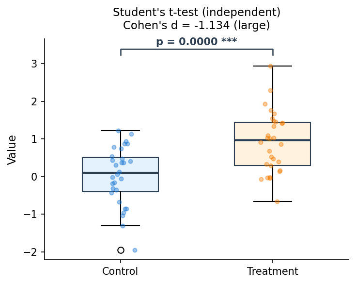

Examples
========

Three runnable Jupyter notebooks ship with the package under
``examples/`` — each one executes end-to-end in CI and is the
canonical reference for its workflow.

.. list-table::
   :header-rows: 1
   :widths: 35 65

   * - Notebook
     - Workflow
   * - `01_basic_ttest.ipynb <https://github.com/SciTeX-AI/scitex-stats/blob/develop/examples/01_basic_ttest.ipynb>`__
     - ``run_test("ttest_ind", …)`` → unified result dict → APA string
   * - `02_test_recommendation.ipynb <https://github.com/SciTeX-AI/scitex-stats/blob/develop/examples/02_test_recommendation.ipynb>`__
     - ``StatContext`` → ``recommend_tests`` → top recommendation through ``run_test``
   * - `03_multiple_comparison.ipynb <https://github.com/SciTeX-AI/scitex-stats/blob/develop/examples/03_multiple_comparison.ipynb>`__
     - Family of comparisons → ``correct.correct_fdr`` (Benjamini-Hochberg)

To re-execute every notebook in place (refreshing outputs):

.. code-block:: bash

   bash examples/00_run_all.sh

Example 1 — Basic t-test
-------------------------

   **Figure 1.** Box plot with individual data points, significance bracket,
   p-value, and effect size — generated from the unified result dictionary.

.. code-block:: python

   import numpy as np
   import scitex_stats as ss

   rng = np.random.default_rng(42)
   group1 = rng.normal(0.0, 1.0, 30)
   group2 = rng.normal(0.5, 1.0, 30)

   result = ss.run_test("ttest_ind", data=group1, data2=group2)

   assert result["stat_symbol"] == "t"
   assert result["effect_size_metric"] == "Cohen's d"
   print(result["formatted"])
   # → t = -3.2101, p = 0.0022, Cohen's d = -0.829, **

Example 2 — Automatic test recommendation
------------------------------------------

.. code-block:: python

   import scitex_stats as ss

   ctx = ss.StatContext(
       n_groups=2,
       sample_sizes=[30, 30],
       outcome_type="continuous",
       design="between",
       paired=False,
   )
   ss.recommend_tests(ctx, top_k=3)
   # → ['ttest_ind', 'welch_t', 'brunner_munzel']

Example 3 — Multiple comparison correction
-------------------------------------------

.. code-block:: python

   from scitex_stats import correct

   results = [
       {"pvalue": 0.010, "var_x": "A", "var_y": "B"},
       {"pvalue": 0.040, "var_x": "A", "var_y": "C"},
       {"pvalue": 0.030, "var_x": "A", "var_y": "D"},
       {"pvalue": 0.200, "var_x": "B", "var_y": "C"},
       {"pvalue": 0.005, "var_x": "B", "var_y": "D"},
       {"pvalue": 0.080, "var_x": "C", "var_y": "D"},
   ]

   corrected = correct.correct_fdr(results, alpha=0.05, method="bh")
   # → BH-adjusted p-values + rejection mask + α_adjusted per comparison
