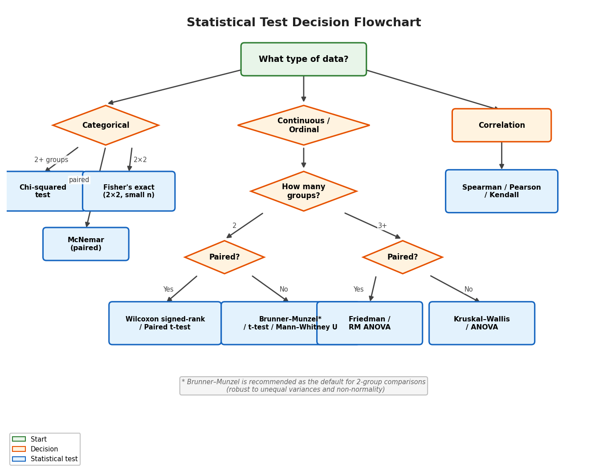

SciTeX Stats
============

.. image:: _static/scitex-logo-banner.png
   :alt: SciTeX Stats
   :align: center
   :width: 400px

.. raw:: html

   
<b>Publication-ready statistical testing with 23 tests, effect sizes, power analysis, and APA formatting</b>

    

**SciTeX Stats** provides a unified interface for the full statistical workflow:
from test recommendation through execution to publication-ready output. All 23
tests return a consistent result dictionary with test statistics, p-values,
effect sizes, power analysis, and APA-formatted strings.

.. toctree::
   :maxdepth: 2
   :caption: Getting Started

   installation
   quickstart

.. toctree::
   :maxdepth: 2
   :caption: User Guide

   choosing_tests
   unified_output
   cli
   mcp

.. toctree::
   :maxdepth: 2
   :caption: API Reference

   api/index

.. toctree::
   :maxdepth: 2
   :caption: Examples

   examples

Quick Example
-------------

.. code-block:: python

   import scitex_stats as ss

   # Get test recommendation
   ctx = ss.StatContext(
       n_groups=2, sample_sizes=[30, 30],
       outcome_type="continuous", design="between", paired=False,
   )
   recs = ss.recommend_tests(ctx)

   # Run a test
   result = ss.run_test("ttest_ind", data=group1, data2=group2)

   # APA-formatted output
   print(result["formatted"])
   # t = -3.210, p = 0.0022, Cohen's d = -0.829, **

   **Figure 1.** Decision flowchart for choosing a statistical test. Starting from
   data type (categorical vs. continuous), the tree guides researchers through
   number of groups and study design to the appropriate test. Brunner-Munzel is
   recommended as the default for two-group comparisons due to its robustness.

Indices and tables
==================

* :ref:`genindex`
* :ref:`modindex`
* :ref:`search`
